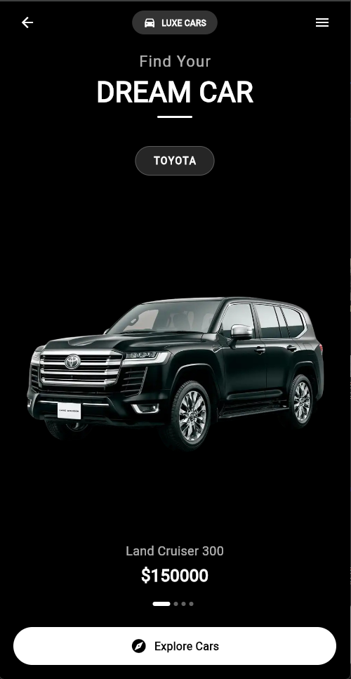
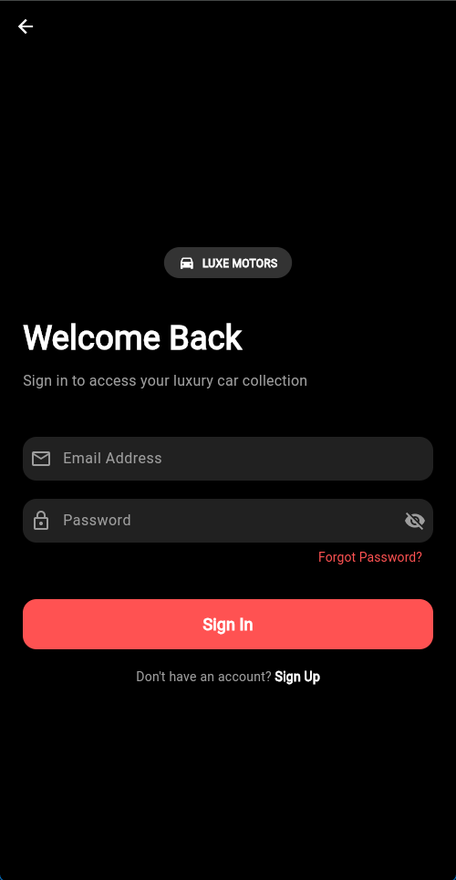

# 🏎️ Luxe Cars - Premium Car Showroom App

A high-performance, luxury car showcase application built with **Flutter** & **Dart**. This app features a premium dark-themed UI, fluid animations, and immersive user interactions designed to provide a top-tier user experience.

Developed by **Dinesh Madusanka** @ [Inflixt Global (PVT) LTD](https://inflixtglobal.com) 🚀

---

## 📱 App Demo & Screenshots

Experience the smooth transitions and luxury feel of Luxe Motors.


| Home Screen 🏠 | Details Page 🏎️ | Login Screen 🔐 |
|:---:|:---:|:---:|
|  |  |  |

---

## ✨ Key Features

* **💎 Premium Dark UI:** A sophisticated dark theme with glassmorphism elements for a modern luxury aesthetic.
* **🔄 Smooth Transitions:** Seamless background color morphing using `AnimatedContainer` as users browse through car models.
* **🚀 Hero Animations:** Fluid visual continuity when transitioning from the car list to the details view.
* **🖱️ Interactive Navigation:** Custom `PageView` implementation with smooth sliding gestures and dot indicators.
* **🔐 Modern Login UI:** A sleek, professional login interface linked seamlessly to the main dashboard.
* **📱 Responsive Design:** Optimized for various screen sizes with `SafeArea` and flexible layouts.

---

## 🛠️ Tech Stack & Concepts

* **Framework:** Flutter (Dart)
* **Architecture:** MVC Pattern (Model-View-Controller)
* **Animations:** Hero Widgets, AnimatedContainer, Custom Transitions
* **UI Components:** Glassmorphism, Gradients, Custom Shapes
* **Navigation:** Flutter Navigator & MaterialPageRoute

---

## 🚀 How to Run

1.  **Clone the repository**
    ```bash
    git clone [https://github.com/DineshMadusanka/luxe-motors.git](https://github.com/DineshMadusanka/luxe-motors.git)
    ```
2.  **Install dependencies**
    ```bash
    flutter pub get
    ```
3.  **Run the app**
    ```bash
    flutter run
    ```

---

## 👨‍💻 Author

**Dinesh Madusanka** (DineshDev)
* **Founder:** Inflixt Global (PVT) LTD
* **Role:** Full-Stack Developer
* **LinkedIn:** [Dinesh Madusanka](https://www.linkedin.com/in/dinesh-madusanka-dev)
* **GitHub:** [DineshMadusanka](https://github.com/DineshMadusanka)
* **Portfolio:** [dineshmadusanka.dev](https://www.dineshmadusanka.dev)

---
*© 2025 Inflixt Global (PVT) LTD. All Rights Reserved.*